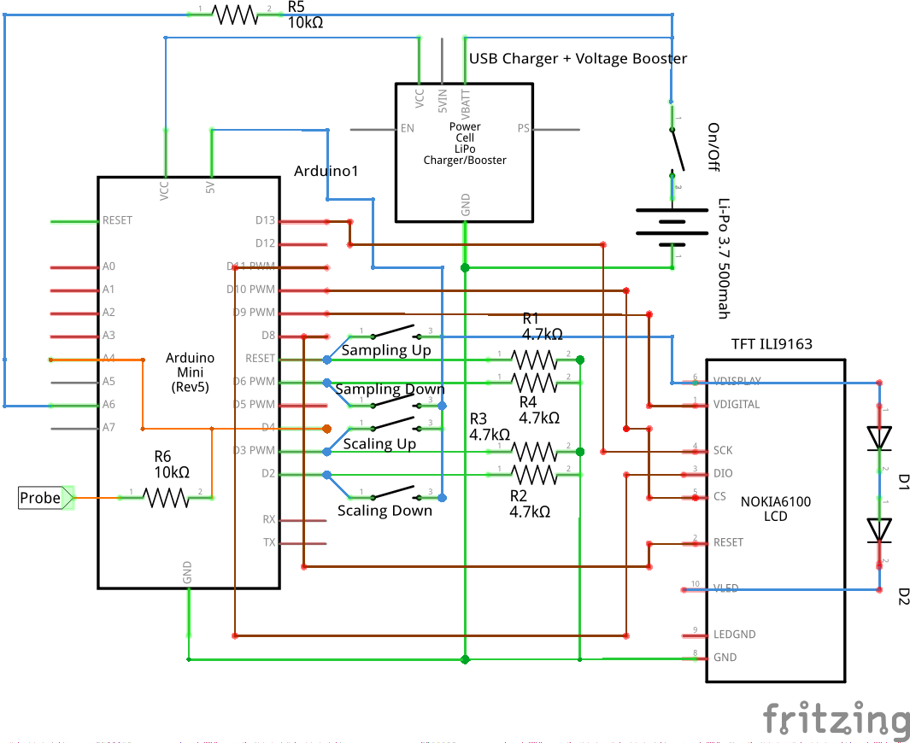
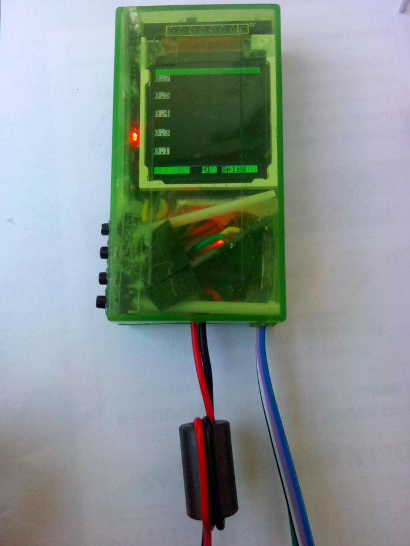
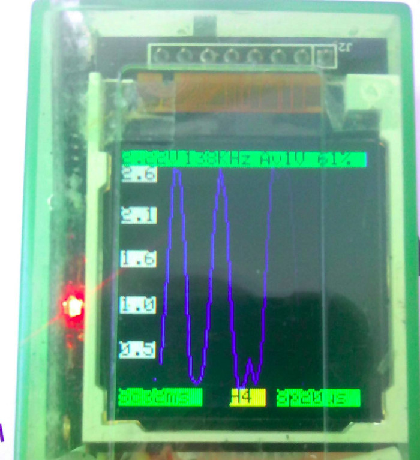

## ArduinoOscilloscope
Simple pocket battery-driven 5V Oscilloscope using Arduino Mini and TFT ILI9163C display. Supports automated scalling frequency- and voltage-wise with total resolution capability of 1MHz. Using voltage divider one can increase voltage range from 5V and up to required value.

## Components

- Arduino Mini (rev5) Atmega 328
- Li-ion/Li-Po 3.7V 500mah
- TP4056 microUSB chargine module
- TFT ILI9163C 1.44" display 
- Probe wire
- 4 tact buttons/switches
- 1 button/switch for power on/off 
- R1-R4 4.7 KOhm
- R5 10 KOhm
- R6 10 KOhm
- D1-D2 1N4007

## Software Requirements
- Arduino IDE 1.8.12
- SPI
- Adafruit GFX
- FreqCount 1.3.0
- Adafruit PCD8544 Nokia 5110 LCD support
- TFT ILI9163C library

## Proof-of-concept device

## Misc
The inspiration for this project came from http://srukami.inf.ua/pultoscop_v1_1.html However, completely rebuilt and fitted to TFT ILI9163C display, including automated scaling.

